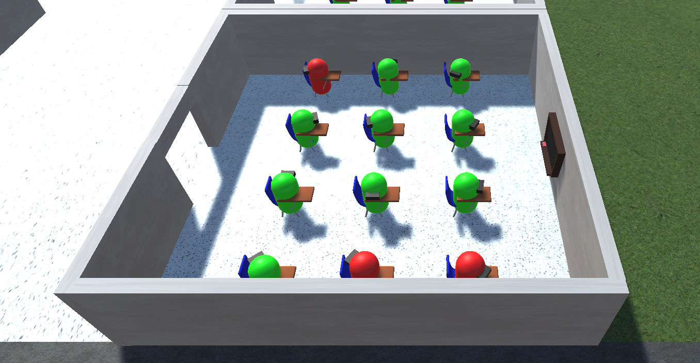

# Covid-19 Simulator

Playable in browser! Please use the following link:
https://qcgeneral29.github.io/CSC-490-Individual-Project-Build/

This game was part of my CSC-490 class at Augustana College. For my individual project, I wanted to create a Covid-19 based simulation game. The goal was to allow the player to tweak certain parameters for the virus. These parameters would apply at the end of every "class period". Class periods start and end whenever the player clicks the "Next Class" button.

Pawns colored green are not infected.

Pawns colored red are infected.

When an infected pawn comes close to a uninfected pawn, there is a percent chance that the infection will spread.

The player can tweak the initial chance of infection, the infection risk, infection radius, and social distance between pawns.